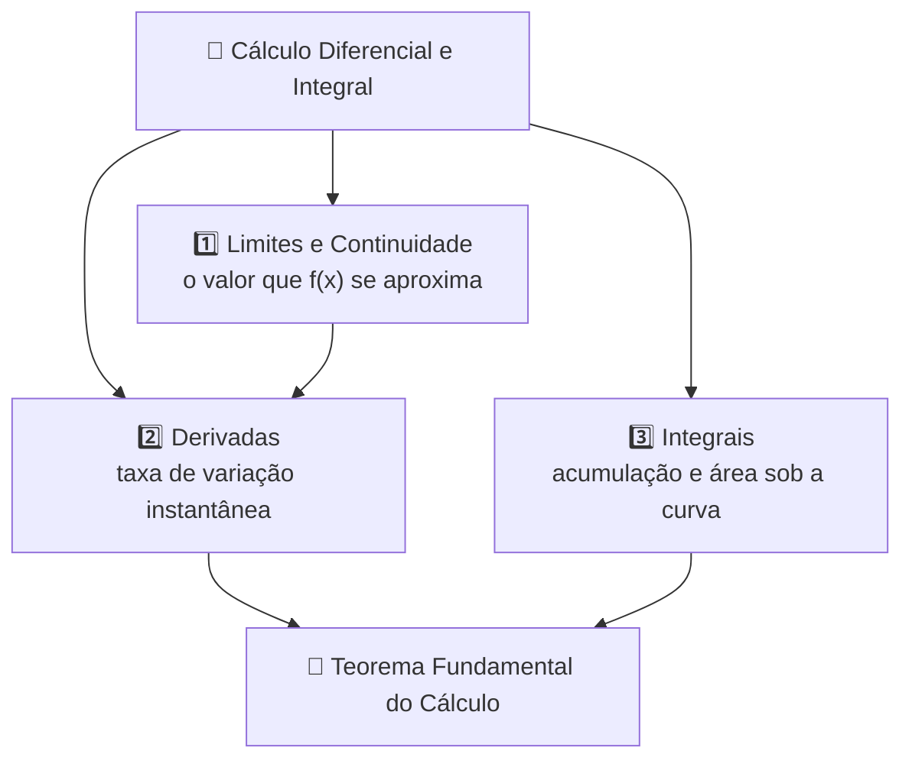

# 🧮 Cálculo Diferencial e Integral

> [!abstract] Definição
> O **Cálculo Diferencial e Integral** é o ramo da Matemática que estuda a **variação contínua** das grandezas. Apoia-se em dois conceitos complementares — a **derivada**, que mede a taxa de variação instantânea de uma função, e a **integral**, que mede o acúmulo de uma grandeza ao longo de um intervalo. Ambos são formalizados pelo conceito de **limite** e unificados pelo **Teorema Fundamental do Cálculo**.

---

## 🎯 Objetivos

- Compreender o conceito de **limite** e de continuidade de uma função
- Interpretar geometricamente a **derivada** como coeficiente angular da reta tangente
- Dominar as regras de derivação, em especial a **regra da cadeia**
- Aplicar derivadas em problemas de **otimização** e taxas de variação
- Compreender a **integral** como antiderivada e como área sob a curva (somas de Riemann)
- Aplicar o **Teorema Fundamental do Cálculo** para resolver integrais definidas
- Dominar as técnicas básicas de integração: substituição, partes e frações parciais

---

## 🗺️ Os Três Pilares

> [!info] A relação que dá nome ao Cálculo
> A **derivada** e a **integral** são operações **inversas** entre si — assim como a multiplicação desfaz a divisão. É essa inversão que o Teorema Fundamental do Cálculo formaliza, e é o que permite calcular áreas sem recorrer a somas infinitas.

---

## 1️⃣ Limites e Continuidade

O **limite** descreve o comportamento de uma função nas **proximidades** de um ponto, sem necessariamente avaliá-la nesse ponto.

$$\lim_{x \to a} f(x) = L$$

Isso significa: os valores de $f(x)$ tornam-se arbitrariamente próximos de $L$ quando $x$ se aproxima de $a$. O limite **existe** se, e somente se, os **limites laterais** forem iguais:

$$\lim_{x \to a^-} f(x) = \lim_{x \to a^+} f(x) = L$$

### Indeterminações

Formas como $\frac{0}{0}$ e $\frac{\infty}{\infty}$ **não são respostas** — são apenas sinais de que é preciso manipular a expressão (fatoração, racionalização) ou aplicar a **regra de L'Hôpital**:

$$\lim_{x \to a} \frac{f(x)}{g(x)} = \lim_{x \to a} \frac{f'(x)}{g'(x)} \quad \text{(se } \tfrac{0}{0} \text{ ou } \tfrac{\infty}{\infty}\text{)}$$

### Limites Fundamentais

$$\lim_{x \to 0} \frac{\operatorname{sen} x}{x} = 1 \qquad \lim_{x \to 0} (1+x)^{\frac{1}{x}} = e \qquad \lim_{x \to \infty} \left(1 + \frac{1}{x}\right)^{x} = e$$

### Continuidade

Uma função é **contínua** em $x = a$ quando três condições valem simultaneamente:

1. $f(a)$ está definida;
2. $\lim_{x \to a} f(x)$ existe;
3. $\lim_{x \to a} f(x) = f(a)$.

---

## 2️⃣ Derivadas

A **derivada** de $f$ em $x$ é o limite do quociente de diferenças — a **taxa de variação instantânea**:

$$f'(x) = \lim_{h \to 0} \frac{f(x+h) - f(x)}{h}$$

> [!important] Duas leituras da mesma grandeza
> - **Geométrica:** $f'(x_0)$ é o **coeficiente angular da reta tangente** ao gráfico de $f$ no ponto $x_0$.
> - **Física:** se $s(t)$ é a posição, então $s'(t)$ é a **velocidade instantânea** e $s''(t)$ é a **aceleração**.

**Equação da reta tangente** em $x_0$:

$$y - f(x_0) = f'(x_0)\,(x - x_0)$$

### Regras de Derivação

| Regra | Fórmula |
|---|---|
| Constante | $\dfrac{d}{dx}(c) = 0$ |
| Potência | $\dfrac{d}{dx}\left(x^n\right) = n\,x^{n-1}$ |
| Soma | $(f \pm g)' = f' \pm g'$ |
| Produto | $(f \cdot g)' = f'g + fg'$ |
| Quociente | $\left(\dfrac{f}{g}\right)' = \dfrac{f'g - fg'}{g^2}$ |
| **Cadeia** | $\big(f(g(x))\big)' = f'\big(g(x)\big) \cdot g'(x)$ |

### Derivadas Fundamentais

| $f(x)$ | $f'(x)$ |
|---|---|
| $c$ | $0$ |
| $x^n$ | $n\,x^{n-1}$ |
| $e^x$ | $e^x$ |
| $\ln x$ | $\dfrac{1}{x}$ |
| $\operatorname{sen} x$ | $\cos x$ |
| $\cos x$ | $-\operatorname{sen} x$ |
| $\operatorname{tg} x$ | $\sec^2 x$ |

### Aplicações

- **Máximos e mínimos:** pontos críticos onde $f'(x) = 0$; o **teste da segunda derivada** classifica o ponto ($f'' < 0$ máximo, $f'' > 0$ mínimo).
- **Otimização:** maximizar área, volume, lucro ou minimizar custo — modela-se a função e iguala-se a derivada a zero.
- **Taxas relacionadas:** grandezas que variam no tempo e estão ligadas por uma equação (ex.: raio e volume de uma esfera).

---

## 3️⃣ Integrais

### Integral Indefinida (Antiderivada)

$$F(x) = \int f(x)\,dx \iff F'(x) = f(x)$$

Toda integral indefinida é uma **família de funções** que difere por uma constante $C$, pois a derivada de uma constante é nula:

$$\int f(x)\,dx = F(x) + C$$

### Integral Definida

A **integral definida** é o limite das **somas de Riemann** e representa a **área líquida** entre o gráfico e o eixo $x$ no intervalo $[a,b]$:

$$\int_a^b f(x)\,dx = \lim_{n \to \infty} \sum_{i=1}^{n} f(x_i)\,\Delta x$$

Áreas **abaixo** do eixo entram com sinal **negativo** — por isso se fala em área "líquida" (ou algébrica).

### Técnicas de Integração

| Técnica | Quando usar | Fórmula |
|---|---|---|
| **Substituição** | Há uma função e sua derivada no integrando | $\int f(g(x))\,g'(x)\,dx = \int f(u)\,du$ |
| **Por partes** | Produto de funções de tipos diferentes | $\int u\,dv = uv - \int v\,du$ |
| **Frações parciais** | Função racional com denominador fatorável | Decompor antes de integrar |

---

## 🔗 Teorema Fundamental do Cálculo

> [!important] O elo entre derivação e integração
> Se $f$ é contínua em $[a,b]$ e $F$ é uma antiderivada de $f$ (isto é, $F' = f$), então:
> $$\int_a^b f(x)\,dx = F(b) - F(a)$$
> O teorema permite calcular integrais definidas **sem** recorrer a somas infinitas: basta encontrar uma antiderivada e avaliá-la nos extremos.

---

## 📋 Integrais Imediatas

| Integral | Resultado |
|---|---|
| $\displaystyle\int k\,dx$ | $kx + C$ |
| $\displaystyle\int x^n\,dx$ | $\dfrac{x^{n+1}}{n+1} + C \quad (n \neq -1)$ |
| $\displaystyle\int \dfrac{1}{x}\,dx$ | $\ln|x| + C$ |
| $\displaystyle\int e^x\,dx$ | $e^x + C$ |
| $\displaystyle\int \operatorname{sen} x\,dx$ | $-\cos x + C$ |
| $\displaystyle\int \cos x\,dx$ | $\operatorname{sen} x + C$ |

---

---

## 🖼️ Exemplos visuais

![[mat-calculo-tangente.svg]]

*Da secante à tangente: a derivada é a inclinação no ponto.*

![[mat-calculo-riemann.svg]]

*Somas de Riemann com n = 4, 8 e 16 convergindo para 1.*

![[mat-calculo-area.svg]]

*A área sob 3x² em [0, 1] vale exatamente 1, pelo Teorema Fundamental.*

## ✏️ Exercícios

> [!question] 1. Cálculo de Limite com Indeterminação
> Calcule $\displaystyle\lim_{x \to 2} \frac{x^2 - 4}{x - 2}$.

> [!success]- Resposta sugerida
> Substituindo diretamente, obtém-se $\frac{0}{0}$ — indeterminação. Fatorando o numerador como **diferença de quadrados**:
> $$\frac{x^2 - 4}{x - 2} = \frac{(x-2)(x+2)}{x-2} = x + 2 \quad (x \neq 2)$$
> Portanto, $\displaystyle\lim_{x \to 2} (x + 2) = \boxed{4}$. Note que o limite existe **mesmo que** $f(2)$ não esteja definida.

> [!question] 2. Regra do Produto
> Derive $f(x) = x^3 \cdot \operatorname{sen} x$.

> [!success]- Resposta sugerida
> Aplicando $(f \cdot g)' = f'g + fg'$ com $f = x^3$ e $g = \operatorname{sen} x$:
> $$f'(x) = 3x^2 \cdot \operatorname{sen} x + x^3 \cdot \cos x = \boxed{3x^2\operatorname{sen} x + x^3\cos x}$$

> [!question] 3. Regra da Cadeia
> Derive $f(x) = (3x + 1)^5$.

> [!success]- Resposta sugerida
> Tratando a expressão como $f(u) = u^5$ com $u = 3x + 1$:
> $$f'(x) = 5u^4 \cdot u' = 5(3x+1)^4 \cdot 3 = \boxed{15(3x+1)^4}$$

> [!question] 4. Integral Indefinida
> Calcule $\displaystyle\int (2x + 1)\,dx$.

> [!success]- Resposta sugerida
> Integrando termo a termo pela regra da potência:
> $$\int (2x + 1)\,dx = 2 \cdot \frac{x^2}{2} + x + C = \boxed{x^2 + x + C}$$
> A constante $C$ é indispensável: qualquer valor dela produz uma função cuja derivada é $2x + 1$.

> [!question] 5. Teorema Fundamental do Cálculo
> Calcule $\displaystyle\int_0^1 3x^2\,dx$.

> [!success]- Resposta sugerida
> Uma antiderivada de $3x^2$ é $F(x) = x^3$. Aplicando o TFC:
> $$\int_0^1 3x^2\,dx = \Big[x^3\Big]_0^1 = 1^3 - 0^3 = \boxed{1}$$
> Interpretação geométrica: a área sob a parábola cúbica $y = 3x^2$ entre $x = 0$ e $x = 1$ vale exatamente $1$ unidade de área.

---

## 🔗 Links relacionados

- [[Matemática Básica]]
- [[Função Afim]]
- [[Função Quadrática]]
- [[Função Exponencial]]
- [[Função Logarítmica]]
- [[Trigonometria]]
- [[Geometria Analítica]]
- [[Conjuntos Numéricos]]
- [[Intervalos Reais]]
- [[Álgebra Linear]]
- [[Estatística]]
- [[00 - Central de Estudos]]
