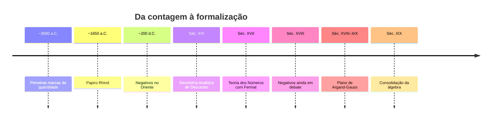

# 🗺️ História dos Números — Mapa de Conteúdo

> [!abstract] Sobre esta aula
> Aula de abertura da disciplina de **Matemática Básica** com participação do pesquisador **Douglas Leite** (doutorando em História da Matemática — UNESP Rio Claro).
> Panorama histórico desde a origem dos números até a formalização dos conjuntos numéricos (séc. XVIII–XIX).

## 📚 Arquivos do tema

- [[01 - Origem dos Números e Comunicação]]
- [[02 - Números na Antiguidade]]
- [[03 - Geometria e Álgebra na História]]
- [[04 - Números Negativos - Um Dilema Histórico]]
- [[05 - Números Imaginários e Complexos]]
- [[06 - Números Transcendentes]]
- [[07 - Teoria dos Números]]
- [[08 - Exercícios Gerais de História dos Números]]

---

## 🖼️ Linha do tempo

## 🎯 Objetivos da aula

- [ ] Compreender que números surgiram como **forma de comunicação**
- [ ] Reconhecer diferentes sistemas de numeração antigos
- [ ] Entender a relação histórica entre **geometria e álgebra**
- [ ] Identificar as dificuldades históricas com negativos, irracionais e complexos
- [ ] Diferenciar números **algébricos** e **transcendentes**
- [ ] Entender o papel dos **números primos** na criptografia

## 🧠 Ideias-chave

> [!important] Mensagem central da aula
> A matemática **demorou muito tempo** para se consolidar. Definições discutidas há 2.000 anos ainda hoje são objeto de estudo.
> Não se deve julgar a matemática antiga com os olhos da matemática atual.

## 🔗 Links relacionados

- [[Matemática Básica]]
- [[Conjuntos Numéricos]]
- [[00 - Teoria dos Conjuntos]]
- [[História da Matemática]]