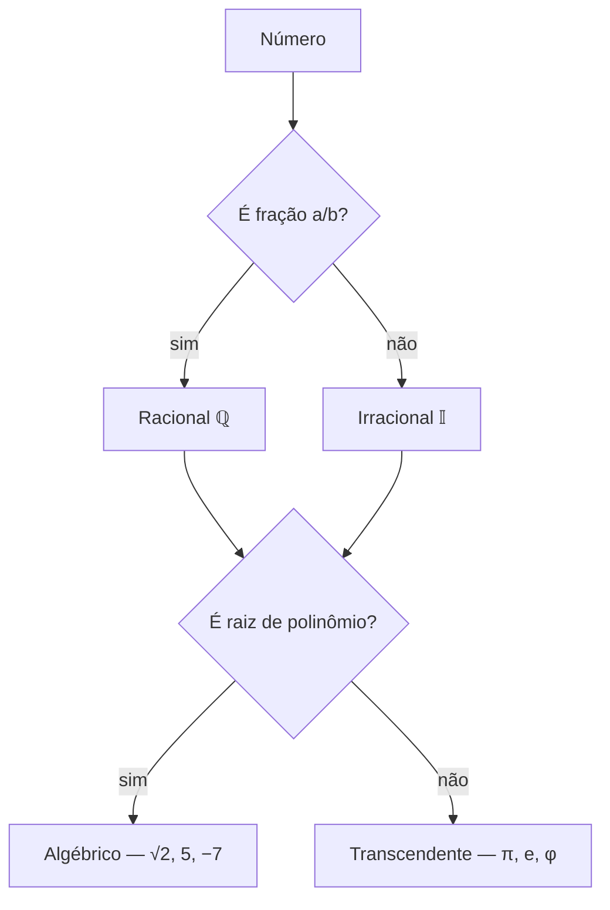

# 08 — Exercícios Gerais de História dos Números

> [!abstract] Instruções
> Resolva os exercícios com base nas notas dos arquivos anteriores.
> As respostas estão em callouts recolhíveis.

---

## 🖼️ Resumo visual

## Parte 1 — Origem e comunicação

> [!question] 1. Explique a frase: "A história dos números é também a história da comunicação".

> [!success]- Resposta sugerida
> Porque, antes de operar, os povos usavam números para identificar quantidades, animais, territórios e transmitir informações — o número funcionava como linguagem.

> [!question] 2. Cite dois registros antigos de uso dos números

> [!success]- Resposta
> Papiro Rhind (Egito) e escrita cuneiforme (Mesopotâmia).

## Parte 2 — Civilizações antigas

> [!question] 3. Associe
> (A) Egito  
> (B) Mesopotâmia  
> (C) Povos originários  
> ( ) Rio Nilo  
> ( ) Entre rios Tigre e Eufrates  
> ( ) Contagem com dedos

> [!success]- Resposta
> A – B – C

## Parte 3 — Geometria e álgebra

> [!question] 4. Por que Pitágoras é um teorema geométrico?

> [!success]- Resposta
> Porque originalmente era formulado como relação entre áreas de quadrados construídos sobre os lados do triângulo retângulo.

> [!question] 5. Em que século e por quem nasceu a Geometria Analítica?

> [!success]- Resposta
> Século XVI, com Descartes, no apêndice *A Geometria* do *Discurso do Método*.

## Parte 4 — Negativos e complexos

> [!question] 6. Por que os negativos foram um dilema histórico?

> [!success]- Resposta
> Porque não havia consenso nem estrutura algébrica consolidada para operá-los. Matemáticos como Antoine Arnauld e Picard discutiram sua validade até o século XVIII.

> [!question] 7. O que é o plano de Argand-Gauss?

> [!success]- Resposta
> É a representação **geométrica** dos números complexos num plano cartesiano: eixo horizontal = parte real; eixo vertical = parte imaginária.

## Parte 5 — Transcendentes

> [!question] 8. Defina número transcendente e dê dois exemplos

> [!success]- Resposta
> Número que não é raiz de nenhuma equação polinomial com coeficientes inteiros. Exemplos: `π` e `e`.

> [!question] 9. Classifique como algébrico ou transcendente:
> `√3`, `π`, `−7`, `e`, `√2`

> [!success]- Resposta
> Algébricos: `√3`, `−7`, `√2`  
> Transcendentes: `π`, `e`

## Parte 6 — Teoria dos Números

> [!question] 10. Liste os 5 primeiros números primos e explique sua importância na criptografia

> [!success]- Resposta
> `2, 3, 5, 7, 11`. Importância: a dificuldade de fatorar números grandes em primos permite criar chaves criptográficas seguras (ex.: RSA).

> [!question] 11. Decomponha em fatores primos:
> a) 72  
> b) 90

> [!success]- Resposta
> a) `72 = 2³ · 3²`  
> b) `90 = 2 · 3² · 5`

---

## 🧠 Gabarito rápido

| Questão | Resposta                                      |
| ------- | --------------------------------------------- |
| 2       | Papiro Rhind, Cuneiforme                      |
| 3       | A – B – C                                     |
| 5       | Séc. XVI, Descartes                           |
| 7       | Plano cartesiano para complexos               |
| 9       | Algébricos: √3, −7, √2 · Transcendentes: π, e |
| 11a     | 2³ · 3²                                       |
| 11b     | 2 · 3² · 5                                    |