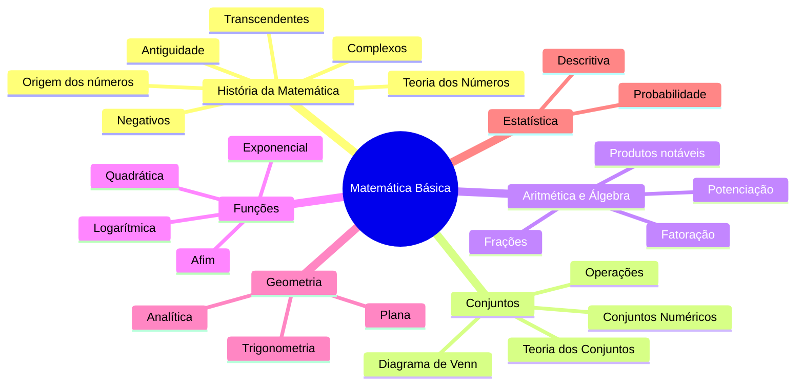

# 📐 Matemática Básica

> [!abstract] Sobre a disciplina
> Disciplina de nivelamento que retoma conceitos fundamentais da educação básica, essenciais para o bom desempenho em disciplinas como **Cálculo**, **Álgebra Linear**, **Estatística** e **Física**.

## 🎯 Objetivos

- Revisar e consolidar conceitos fundamentais da matemática
- Desenvolver raciocínio lógico e algébrico
- Preparar base para disciplinas mais avançadas
- Aplicar conceitos em contextos práticos

## 📚 Tópicos da disciplina

### 🏛️ História da Matemática
- [[00 - História dos Números]]
- [[01 - Origem dos Números e Comunicação]]
- [[02 - Números na Antiguidade]]
- [[03 - Geometria e Álgebra na História]]
- [[04 - Números Negativos - Um Dilema Histórico]]
- [[05 - Números Imaginários e Complexos]]
- [[06 - Números Transcendentes]]
- [[07 - Teoria dos Números]]
- [[08 - Exercícios Gerais de História dos Números]]

### 🔢 Conjuntos
- [[00 - Teoria dos Conjuntos]]
- [[01 - Noções Primitivas e Pertinência]]
- [[02 - Representação de Conjuntos e Diagrama de Venn]]
- [[03 - Conjuntos Especiais - Unitário, Vazio e Universo]]
- [[04 - Igualdade e Subconjuntos]]
- [[05 - Conjunto das Partes e Diferença]]
- [[06 - Exercícios Gerais de Teoria dos Conjuntos]]
- [[Conjuntos Numéricos]]
- [[Diagrama de Venn]]

### ➗ Aritmética e Álgebra
- [[Operações com Frações]]
- [[Potenciação e Radiciação]]
- [[Produtos Notáveis]]
- [[Fatoração]]
- [[Equações e Inequações]]

### 📊 Funções
- [[Função Afim]]
- [[Função Quadrática]]
- [[Função Exponencial]]
- [[Função Logarítmica]]

### 📈 Geometria e Trigonometria
- [[Geometria Plana]]
- [[Geometria Analítica]]
- [[Trigonometria]]

### 📉 Estatística e Probabilidade
- [[Estatística Descritiva]]
- [[Probabilidade]]

---

## 🖼️ Mapa visual da disciplina

## 🗂️ Estrutura das aulas

| Aula | Tema | Status |
|---|---|---|
| 01 | História dos Números | ✅ |
| 02 | Noções Iniciais de Conjuntos | ✅ |
| 03 | Conjuntos Numéricos | ✅ |
| 04 | Operações com Conjuntos | ⬜ |
| 05 | Intervalos Reais | ⬜ |

## 🧠 Conceitos-chave

> [!important] Pré-requisitos essenciais
> - Operações básicas
> - Frações e números decimais
> - Regras de sinais
> - Potenciação e radiciação

## 🔗 Links relacionados

- [[História da Matemática]]
- [[Teoria dos Conjuntos]]
- [[Conjuntos Numéricos]]
- [[Diagrama de Venn]]
- [[Cálculo Diferencial e Integral]]
- [[Álgebra Linear]]
- [[Estatística]]