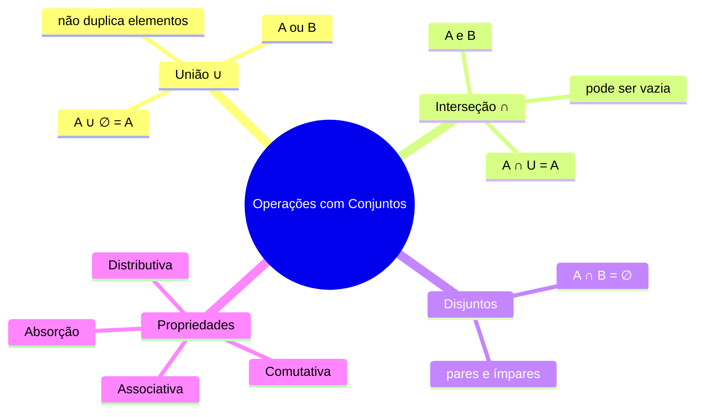

# 🗺️ Operações com Conjuntos — Mapa de Conteúdo

> [!abstract] Sobre esta aula
> Aula 3 da primeira semana de **Matemática Básica**. Continuação das **noções iniciais de conjuntos**, agora focando em **reunião (união)** e **interseção**, além de suas **propriedades**.

## 📚 Arquivos do tema

- [[01 - Reunião (União) de Conjuntos]]
- [[02 - Interseção de Conjuntos]]
- [[03 - Conjuntos Disjuntos]]
- [[04 - Propriedades da União e da Interseção]]
- [[05 - Propriedades Mistas e Distributivas]]
- [[06 - Exercícios Gerais de Operações com Conjuntos]]

---

## 🖼️ Mapa visual do tema

## 🎯 Objetivos da aula

- [ ] Compreender a **reunião** de conjuntos
- [ ] Compreender a **interseção** de conjuntos
- [ ] Reconhecer **conjuntos disjuntos**
- [ ] Aplicar as **propriedades** da união e da interseção
- [ ] Resolver problemas com **operações mistas** (união + interseção)

## 🧠 Ideias-chave

> [!important] Essência da aula
> - **Reunião (∪):** elementos que pertencem a **A ou B**
> - **Interseção (∩):** elementos que pertencem a **A e B**
> - Ordem **não importa** (comutatividade)
> - Agrupamento **não importa** (associatividade)

## 🔗 Links relacionados

- [[00 - Teoria dos Conjuntos - MOC]]
- [[Diagrama de Venn]]
- [[Conjuntos Numéricos]]
- [[Matemática Básica]]