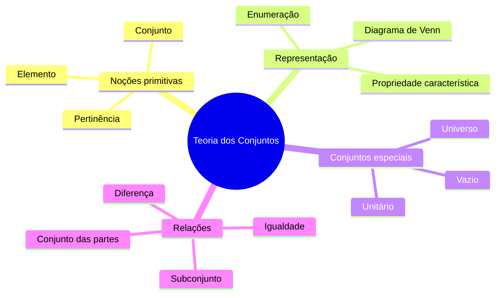

# 🗺️ Teoria dos Conjuntos — Mapa de Conteúdo

> [!abstract] Sobre este MOC
> Aula introdutória de **Matemática Básica** sobre **Noções Iniciais de Conjuntos**.
> Conteúdo separado por temas para facilitar revisão e aprofundamento.

## 📚 Arquivos do tema

- [[01 - Noções Primitivas e Pertinência]]
- [[02 - Representação de Conjuntos e Diagrama de Venn]]
- [[03 - Conjuntos Especiais - Unitário, Vazio e Universo]]
- [[04 - Igualdade e Subconjuntos]]
- [[05 - Conjunto das Partes e Diferença]]
- [[06 - Exercícios Gerais de Teoria dos Conjuntos]]

---

## 🖼️ Mapa visual do tema

## 🔑 Resumo geral

| Conceito | Notação |
|---|---|
| Pertence | `∈` |
| Não pertence | `∉` |
| Conjunto vazio | `∅` ou `{ }` |
| Conjunto universo | `U` |
| Igualdade | `=` |
| Subconjunto | `⊆` |
| Contém | `⊇` |
| Conjunto das partes | `P(A)` |
| Diferença | `A − B` |
| Tal que | `\|` |

## 🎯 Objetivos da aula

- [ ] Compreender as noções primitivas: conjunto, elemento e pertinência
- [ ] Representar conjuntos por enumeração e por propriedade
- [ ] Identificar conjunto unitário, vazio e universo
- [ ] Aplicar igualdade, subconjunto, conjunto das partes e diferença
- [ ] Resolver exercícios de fixação

## 🔗 Links úteis

- [[Matemática Básica]]
- [[Diagrama de Venn]]
- [[Conjuntos Numéricos]]